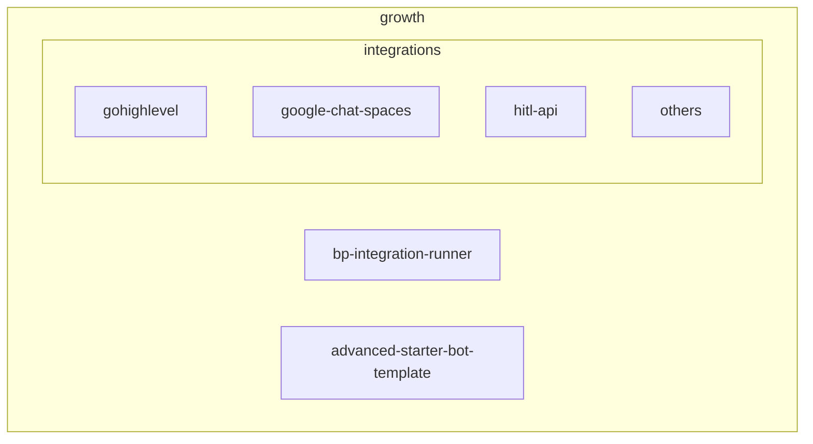
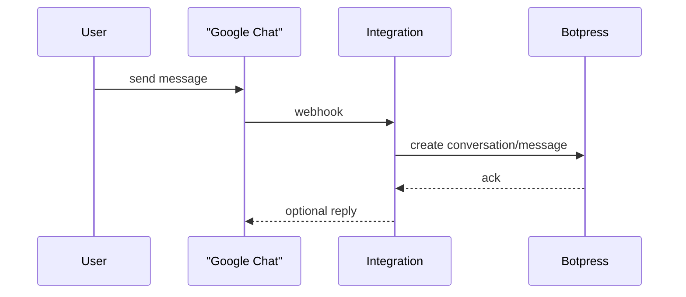

# Botpress Growth

Botpress Growth is a collection of official integrations and tooling that help developers extend the Botpress platform. This monorepo contains reusable packages, a set of ready-made integrations and an advanced bot template that demonstrates common patterns.

## Repository Structure

- **`bp-integration-runner`** – Utility to run and expose a Botpress integration locally using ngrok.
- **`integrations/`** – Individual integration packages (e.g. GoHighLevel, Google Chat, Salesforce, HubSpot HITL, TwilioVoice, SharePoint, etc.).
- **`advanced-starter-bot-template`** – Example bot project showcasing advanced techniques.

## Architecture



### Runtime Interaction (example: Google Chat)


## Process Breakdown

### bp-integration-runner
Runs a local integration with live reload and updates its URL in Botpress. Environment variables are loaded from `.env` and checked for required keys `BOTPRESS_PAT` and `BOTPRESS_WORKSPACE_ID` as shown in the script.
Entry point: [`bp-integration-runner/run.js`](bp-integration-runner/run.js).

### Integrations
Each folder under `integrations/` is a standalone package. The entry file is `src/index.ts` and configuration schema is defined in `integration.definition.ts`. For example, the Google Chat integration expects a service account JSON and a default space ID in its configuration【F:integrations/google-chat-spaces/integration.definition.ts†L1-L18】.

### Advanced Starter Bot Template
A ready‑to‑use bot showcasing techniques such as event tracking, loading user data and live agent handoff. See the topics covered in its README【F:advanced-starter-bot-template/README.md†L1-L17】.

## Integration Development

To develop an integration, start by installing the [Botpress CLI](https://www.npmjs.com/package/@botpress/cli):

```sh
npm install -g @botpress/cli # for npm
yarn global add @botpress/cli # for yarn
pnpm install -g @botpress/cli # for pnpm
```

Then, in the directory of your choice, create a new integration:

```sh
bp init
```

This command will generate an integration from one of the proposed templates.

For more information on how to develop an integration, please refer to the [Integration Documentation](https://botpress.com/docs/getting-started-1).

## Setup & Local Development

1. **Prerequisites** – Node.js 18+, [pnpm](https://pnpm.io) 8.
2. Install dependencies: `pnpm install`.
3. Optional: create `.env` at the project root with credentials for the runner or integrations.
4. Run tests: `pnpm test` (uses Vitest)【F:package.json†L4-L9】.
5. Lint & type-check: `pnpm check`【F:package.json†L21-L22】.

## Deployment

Each integration can be deployed with the Botpress CLI (`bp deploy`) or via `pnpm run deploy` in the integration folder. A GitHub Action verifies that the integration version is bumped before merging new changes.

To deploy your integration to your workspace:

```sh
bp deploy
```

This will deploy your integration's current version to your workspace and make it available to all your bots. If this version is already deployed, it will be updated. Otherwise, a new version will be created.

By default, all integrations are private to the workspace they have been deployed in. When you are ready to share your version with the community, you can make it public by running:

```sh
bp deploy --public
```

This will make your integration available to all Botpress users on the [Botpress Hub](https://app.botpress.cloud/hub). Once a version of your integration is public, it cannot be updated again.

## Resources

- [Botpress Cloud](https://app.botpress.cloud)
- [Botpress Documentation](https://botpress.com/docs)
- [Botpress Hub](https://app.botpress.cloud/hub)
- [Botpress SDK](https://www.npmjs.com/package/@botpress/sdk)
- [Botpress CLI](https://www.npmjs.com/package/@botpress/cli)

## Contributing

- Format and lint code using `pnpm fix` or run `pnpm check` before committing.
- Keep commit messages concise and in the imperative mood.
- New integrations should place code under `integrations/<name>` and include a `package.json` with a unique `integrationName` field.

We love contributions from the community! For bugs or features related to the advanced bot template, integrations, botpress-integration-runner or anything else, please talk to us on [Discord](https://discord.gg/botpress) instead.

## Licensing

All packages in this repository are open-source software and licensed under the [MIT License](LICENSE). By contributing in this repository, you agree to release your code under this license as well.

Let's build the future of chatbot development together! 🤖🚀
